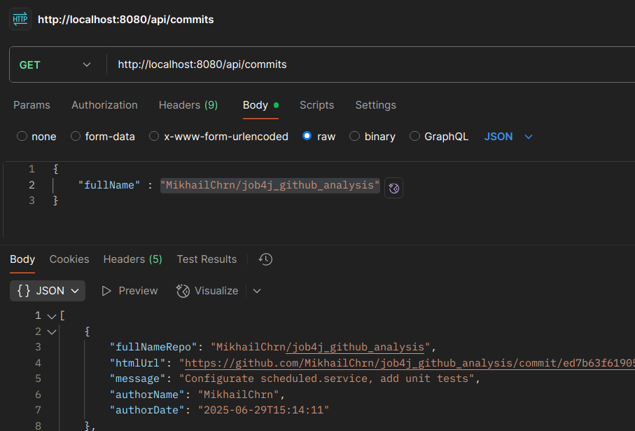

## Веб-сервис "Анализ данных с GitHub".

### Описание:

Веб-сервис по расписанию собирает информацию о репозиториях и коммитах с публичного API GitHub.com, а затем сохраняет эти данные в базу данных. 

### Используемые технологии:

+ Java 17
+ REST API
+ Spring Boot

### Окружение:

+ Java 17
+ Maven
+ PostgreSQL

### API

|      |                        |                                                     |
|------|------------------------|-----------------------------------------------------|
| POST | /api/repos             | Сохраняем репозиторий в БД                          |
| GET  | /api/commits           | Получаем перечень локально сохранённых коммитов     |
| GET  | /api/repos             | Получаем перечень локально сохранённых репозиториев |

* Формат названия репозитория : 'author/repository'
* Пример названия репозитория : 'MikhailChrn/job4j_social_media_api'

### Получение перечня сохранённых в базе данных коммитов:

### Контакты

mikhail.cherneyev@yandex.ru